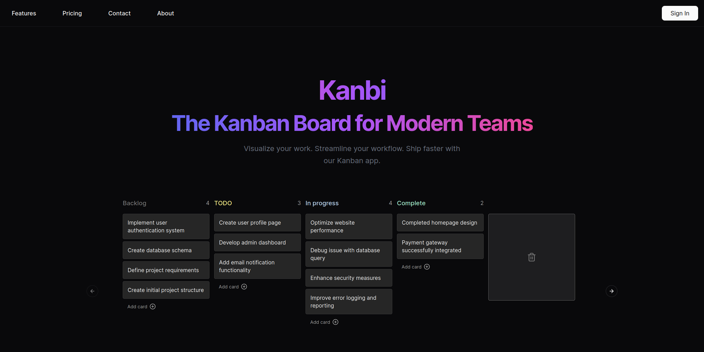

# Kanbi - Kanban App

Kanbi is your ultimate solution for seamless task management. With its sleek design and powerful features, Kanbi streamlines your workflow, making task organization effortless.

## Features

- **Intuitive Interface:** Kanbi offers a user-friendly interface, allowing you to organize your tasks with ease.
- **Drag-and-Drop Functionality:** Effortlessly move tasks between columns using intuitive drag-and-drop functionality.
- **Customizable Boards:** Tailor Kanbi to fit your unique workflow with customizable boards.
- **User Authentication:** Ensure the security of your data with robust user authentication features.
- **Responsive Design:** Access Kanbi anytime, anywhere, with its fully responsive design.

## Why Kanbi?

Kanbi is designed with productivity in mind. Whether you're a solo entrepreneur, a small team, or a large organization, Kanbi adapts to your needs, helping you stay focused and organized.

## Tech Stack

Kanbi leverages cutting-edge technologies to deliver a seamless user experience:

- **Next.js:** A React framework for building fast and scalable web applications.
- **Tailwind CSS:** A utility-first CSS framework for building custom designs quickly.
- **Prisma:** A modern database toolkit for Node.js that simplifies database access.
- **Shadcn UI:** A UI component library for React that provides a rich set of pre-designed components.
- **Supabase:** An open-source alternative to Firebase, offering real-time database capabilities and user authentication.

## Experience Kanbi Today

Visit [Kanbi](https://www.kanbi.vercel.app) now to experience the future of task management.

---

For more information or inquiries, contact me at bartosz.sobina@proton.me

© 2024 Bartosz Sobina. All rights reserved.
